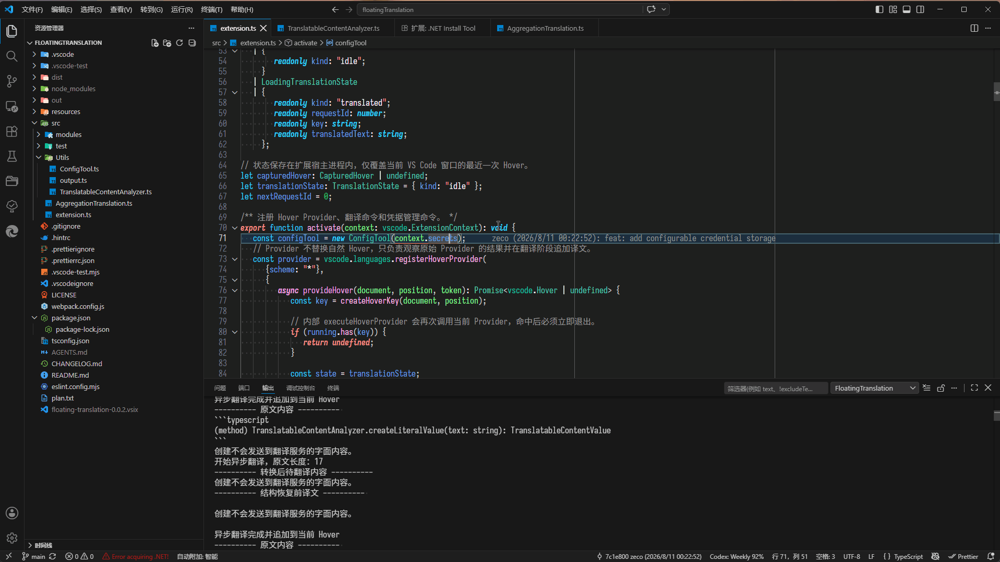

<h1 align="center">Floating Translation</h1>

<p align="center">
    <a href="README.md">简体中文</a> |
    <a href="README.en.md">English</a>
</p>

FloatingTranslation 是一个用于翻译 VS Code 鼠标悬浮窗口（Hover）内容的扩展。它会捕获最近一次 Hover，在用户主动触发命令后翻译其中的自然语言内容，并将译文追加到重新打开的 Hover 底部。

## 功能

- 通过快捷键主动开始翻译，不改变普通鼠标 Hover 的触发方式。
- 支持阿里云机器翻译、百度翻译开放平台和 OpenAI 兼容服务。
- 支持完整 Hover、代码块保护、平台回传占位符和本地隔离占位符四种翻译尺度。
- OpenAI 兼容服务可以连接远程接口或本地模型服务，并支持自定义完整 Chat Completions 请求地址、模型标识符和附加翻译偏好。
- 同一 Hover 的翻译仍在执行时会复用当前任务；已有译文时再次按快捷键会抛弃匹配缓存并重新调用翻译服务。
- 翻译成功后的最终译文会按当前工作区缓存；自然 Hover 再次出现时命中缓存即可直接显示，不需要再次触发翻译。
- 阿里云和百度翻译支持可配置的 QPS 与并发上限；批量请求失败或被替换后不再调度剩余片段。
- 凭据可以保存在 VS Code 普通用户设置或 `SecretStorage` 中。

## 使用方式



1. 将鼠标移动到能够显示 Hover 的代码位置，等待原始 Hover 出现。
2. 在 VS Code 设置中选择翻译服务，并配置对应的服务参数、凭据和语言代码。
3. 按 `Ctrl+Alt+T`，或从命令面板执行 `Floating Translation: trigger`。
4. 扩展会回到最近捕获的 Hover 位置，重新打开 Hover，并在翻译完成后追加译文。
5. 后续再次显示相同 Hover 时，若当前工作区存在匹配缓存，扩展会直接追加缓存译文。

默认快捷键为 `Ctrl+Alt+T`。如有冲突，可以在 VS Code 键盘快捷方式设置中为命令 `floatingTranslation.trigger` 重新绑定快捷键。

可在 VS Code 设置中配置以下项目：

| 配置项                                               | 说明                                                                                    |
| ---------------------------------------------------- | --------------------------------------------------------------------------------------- |
| `floating-translation.sourceLanguage`                | 待翻译文本的源语言代码。                                                                |
| `floating-translation.targetLanguage`                | 译文的目标语言代码；留空时使用 VS Code 当前显示语言。                                   |
| `floating-translation.translationTool`               | 当前使用的翻译服务，可选 `aliyun`、`baidu` 或 `openaiCompatible`。                      |
| `floating-translation.translationMode`               | 控制发送给翻译服务的内容范围和受保护内容的处理方式，具体模式参见[翻译尺度](#翻译尺度)。 |
| `floating-translation.credentialStorage`             | 凭据存储方式，可选明文设置 `settings` 或加密存储 `secretStorage`。                      |
| `floating-translation.maxCacheCount`                 | 当前工作区最多保存的翻译缓存条目数，必须大于或等于 `1`。                                |
| `floating-translation.generalPlatformCredentials`    | 一般翻译开发平台请求上限与凭据配置。                                                    |
| `floating-translation.openAiCompatibleConfiguration` | OpenAI 兼容服务的请求地址、API Key、模型和附加翻译偏好配置。                            |

### `floating-translation.generalPlatformCredentials`

| 字段                    | 说明                                                        |
| ----------------------- | ----------------------------------------------------------- |
| `QPS`                   | 每秒启动及同时进行的最大请求数，必须大于或等于 `1`。        |
| `aliyunAccessKeyId`     | 阿里云 AccessKey ID；凭据存储方式为 `settings` 时读取。     |
| `aliyunAccessKeySecret` | 阿里云 AccessKey Secret；凭据存储方式为 `settings` 时读取。 |
| `baiduAppId`            | 百度翻译 App ID；凭据存储方式为 `settings` 时读取。         |
| `baiduAppKey`           | 百度翻译密钥；凭据存储方式为 `settings` 时读取。            |

### `floating-translation.openAiCompatibleConfiguration`

| 字段                       | 说明                                                                       |
| -------------------------- | -------------------------------------------------------------------------- |
| `openAiCompatibleEndpoint` | 完整的 HTTP 或 HTTPS Chat Completions 请求地址；扩展不会自动拼接请求路径。 |
| `openAiCompatibleApiKey`   | OpenAI 兼容服务的 API Key；凭据存储方式为 `settings` 时读取。              |
| `openAiCompatibleModel`    | 目标服务使用的模型标识符，必须与目标服务的模型列表一致。                   |
| `customPrompt`             | 附加翻译偏好，不能覆盖扩展内置的输出格式和内容保护约束。                   |

当 `credentialStorage` 为 `settings` 时，扩展从两个聚合配置对象中读取凭据。当 `credentialStorage` 为 `secretStorage` 时，需要先选择翻译平台，再从命令面板执行 `Floating Translation: Configure Credentials`，将当前平台的凭据写入 `SecretStorage`。`QPS` 始终从 `generalPlatformCredentials` 读取；OpenAI 兼容服务的请求地址、模型标识符和附加翻译偏好始终从 `openAiCompatibleConfiguration` 读取。

切换凭据存储方式只会改变凭据读取来源，不会迁移或清理已有内容。执行 `Floating Translation: Clear Credentials` 可以清除当前平台或全部平台的加密存储凭据，不会修改普通用户设置中的任何内容。

翻译缓存保存在 VS Code 的 `workspaceState` 中，跟随当前工作区，不写入项目目录，也不会在不同工作区之间共享。扩展不会对缓存内容额外加密；缓存只保存组装完成的最终译文，不保存凭据。执行 `Floating Translation: Clear Workspace Cache` 可以清除当前工作区的全部翻译缓存。

普通用户设置中的凭据以明文形式保存，不应提交到版本控制。使用远程翻译服务时，待翻译文本会发送给当前选择的服务，并可能产生费用；请根据实际数据处理要求核对服务条款、日志留存和合规要求。

### 请求调度与结果复用

扩展使用文档版本、Hover 位置、Hover 内容摘要和翻译配置修订号识别一次当前任务。同一请求仍在执行时，重复按快捷键不会再次调用翻译服务；同一请求已经完成或自然 Hover 已命中缓存时，再次按快捷键会删除匹配缓存并重新调用翻译服务。

当用户移动到其他 Hover 并再次触发翻译时，扩展会终止旧任务，再翻译最近捕获的内容。翻译服务、语言、翻译尺度、平台配置或加密存储凭据发生变化时，正在执行的旧任务会被终止，已完成的最近译文也会失效。

成功翻译的最终组装文本会写入当前工作区的持久缓存，因此扩展重启后仍可在自然 Hover 命中缓存。快捷键强制刷新成功后，新译文会重新写入缓存；刷新失败时不会继续回落到已抛弃的旧译文。缓存键包含原始 Hover 内容摘要、翻译平台、翻译模式、源语言、目标语言，以及 OpenAI 兼容服务的 Endpoint、模型和自定义提示词；这些语义条件变化后不会误用旧译文。凭据、凭据存储方式、QPS 和文档版本不进入缓存键。

缓存使用最近最少使用策略，最多保留 `floating-translation.maxCacheCount` 条目。设置容量变小时会立即裁剪旧条目；执行 `Floating Translation: Clear Workspace Cache` 会清空持久缓存和当前进程中的最近译文状态。

对拆分后的多段内容，任一片段失败或任务被终止后，扩展会停止调度尚未开始的片段。百度和 OpenAI 兼容适配器会通过取消信号中止在途 HTTP 请求。阿里云适配器会停止后续调度并立即结束扩展侧等待，但当前使用的阿里云 SDK 不支持通过公开接口强制中止已经发出的底层请求，因此少量在途请求仍可能在服务端继续执行。

### OpenAI 兼容服务

`openAiCompatibleEndpoint` 必须填写完整的 HTTP 或 HTTPS Chat Completions 请求地址，扩展不会自动拼接请求路径。`openAiCompatibleApiKey` 和 `openAiCompatibleModel` 均不能为空。`customPrompt` 用于提供附加翻译偏好，但不能覆盖扩展内置的输出格式和内容保护约束。

OpenAI 兼容请求使用非流式响应，单次请求超时为 30 秒，并以最多 3 个并发请求处理拆分后的文本片段。OpenAI 兼容服务不使用 `generalPlatformCredentials.QPS`；任务被替换或任一片段失败时，会停止调度后续片段并尝试中止在途请求。

> [!IMPORTANT]
> **扩展会在 OpenAI 兼容请求中同时提供多种关闭思考模式或推理模式的兼容参数。**
>
> 不同模型、推理框架和 API 接入方对这些参数的名称、结构及支持程度并不统一。接入方可能忽略、覆盖或拒绝不支持的参数，因此无法保证关闭思考模式的配置能够触达所有模型和接入方。实际行为应以目标服务的接口文档和响应结果为准。

> [!IMPORTANT]
> **使用本地模型时，首次翻译可能需要等待模型启动。**
>
> 首次请求可能触发本地服务启动或模型加载，等待时间取决于模型大小、硬件性能和本地服务状态。模型处于运行状态后，后续请求通常可以直接进入推理流程。

### 翻译尺度

| 设置值               | 设置界面名称           | 发送给翻译服务的内容                    | 适用场景与风险                                                   | 不推荐平台 |
| -------------------- | ---------------------- | --------------------------------------- | ---------------------------------------------------------------- | ---------- |
| `fullText`           | 全文直译               | 完整 Hover Markdown，包括代码           | 上下文最完整，但代码和 Markdown 格式可能被翻译或改写。           |            |
| `codeBlocks`         | 代码块保护             | 围栏代码块和缩进代码之外的原始 Markdown | 保留块级代码；行内代码、链接和 Markdown 标记仍可能被改写。       |            |
| `remotePlaceholders` | 占位符保护（平台回传） | 包含占位符 token 的分段正文             | 保留较完整的句子上下文，但平台可能修改 token，导致恢复失败。     | 百度翻译   |
| `localPlaceholders`  | 占位符保护（本地隔离） | 占位符之间的自然语言                    | token 不离开本地，保护最可靠；句子可能被拆分，翻译上下文会减少。 |            |

“代码块保护”识别 Markdown 围栏代码块、未闭合围栏和以四个空格或 Tab 缩进的代码。“本地占位符保护”同时保留代码块，并在本地保护行内代码、链接、路径、命令参数和部分代码标识符。

## 内容识别规则

扩展会汇总最近一次 Hover 位置上各个 Hover Provider 返回的内容，并根据所选翻译尺度按以下规则处理：

- 不要求 Hover 以代码围栏开头；任意包含自然语言字母的 Markdown 段落都可能成为待翻译内容。
- 占位符模式会按空行和部分块级 Markdown 结构拆分普通段落，适配器批量发起请求并按原顺序返回结果。
- 两种占位符模式均保留代码围栏、链接定义、分隔线、缩进代码和未闭合围栏。
- 占位符模式会保护行内代码、图片、链接、删除线、粗体、斜体、转义字符、URL、文件路径、命令参数以及部分常见代码标识符。
- 平台回传模式会校验未知、重复和丢失 token；本地隔离模式先在本地精确重建 token，再执行相同校验和恢复。
- 全文直译会处理任意非空 Hover；其他模式在排除代码块或受保护内容后没有自然语言时不会触发翻译，并提示“未检测到需要翻译的文本”。

## 警告与已知限制

> [!WARNING]
> **核心功能依赖兼容性不稳定的 `editor.action.showHover` 命令。**
>
> 当前实现必须调用 `editor.action.showHover` 才能在快捷键触发翻译后重新打开悬浮窗口。
> 该命令没有为本扩展所需的 Hover 位置、触发来源和生命周期提供稳定的公开契约，其行为可能随 VS Code 版本变化。
> 无法保证本插件在未来版本的 VS Code 中仍能正常重新打开 Hover 或追加翻译结果。

> [!WARNING]
> **重新打开的 Hover 无法同时满足“随鼠标移动关闭”和“移入后滚动长内容”。**
>
> 扩展通过命令重新打开的 Hover 会被 VS Code 视为键盘触发的 Hover。
> 当 `editor.hover.sticky` 为 `true` 时，可以将鼠标移入悬浮窗口并滚动查看较长内容，但移动鼠标不会关闭该窗口，需要按 `Esc` 或点击编辑区域关闭。
>
> 将 `editor.hover.sticky` 设置为 `false` 后，移动鼠标可以关闭 Hover，但鼠标也无法稳定移入悬浮窗口，因此较长内容可能无法滚动查看。
> VS Code 当前的稳定扩展 API 不允许本扩展为重新打开的 Hover 指定鼠标触发来源，也不提供可用于可靠模拟该生命周期的编辑器鼠标移动事件，所以目前无法在扩展内部修复这一冲突。
> 扩展不会自动修改用户的 `editor.hover.sticky` 设置。

> [!WARNING]
> **Markdown 块级结构不会全部保留。**
>
> 两种占位符模式会移除列表标记、标题标记和引用标记后翻译正文，因此译文中的列表、标题和引用样式可能丢失。粗体、斜体、删除线和完整 Markdown 链接目前作为整体受保护，其中的可见文字也不会翻译。代码标识符保护基于启发式规则，无法保证覆盖所有命名形式。全文直译和代码块保护使用原始 Markdown，但翻译平台可能改写其格式。

> [!WARNING]
> **项目输出可能包含待翻译文本。**
>
> “悬浮翻译”输出通道会记录翻译服务、字符数和并发数量；使用 OpenAI 兼容服务时还会记录请求地址和模型标识符。如果翻译服务丢失占位符，诊断信息会包含相关原文和译文。处理敏感内容时应注意 VS Code 输出日志的可见范围和留存方式。

## 开发

环境要求：

- Node.js 和 npm。
- VS Code `1.125.0` 或更高版本。

安装依赖：

```shell
npm install
```

常用命令：

```shell
npm run compile
npm run watch
npm run lint
npm test
```

其中 `npm run compile` 和 `npm test` 会生成构建或测试产物；执行前请确认工作区允许写入相应输出目录。

### 打包

生成生产模式的 Webpack 构建：

```shell
npm run package
```

构建结果位于 `dist/`。如需生成可安装和分发的 VSIX 文件，请先安装 VS Code 官方打包工具：

```shell
npm install -g @vscode/vsce
```

然后在项目根目录执行：

```shell
vsce package
```

`vsce package` 会自动执行 `vscode:prepublish`，由该脚本调用 `npm run package` 完成生产构建，并根据 `.vscodeignore` 排除不需要分发的文件。
打包完成后，项目根目录会生成 `floating-translation-<version>.vsix`。

可通过 VS Code 扩展视图右上角的“从 VSIX 安装...”安装该文件，也可以使用命令行：

```shell
code --install-extension floating-translation-<version>.vsix
```
